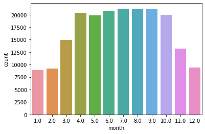
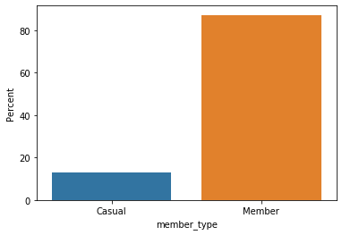
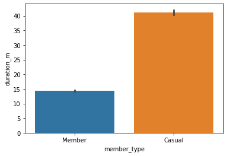
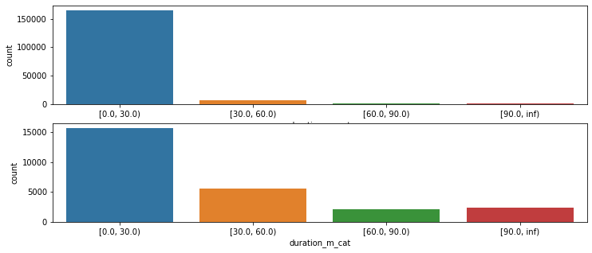
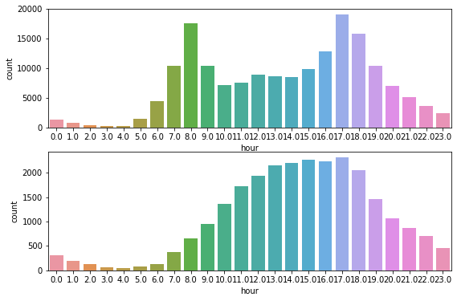
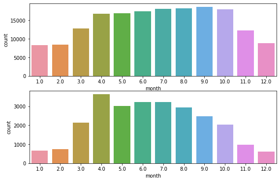
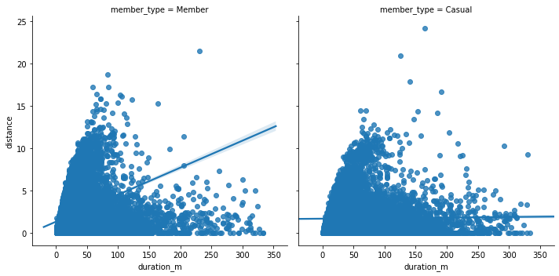
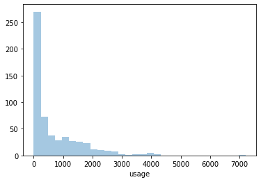
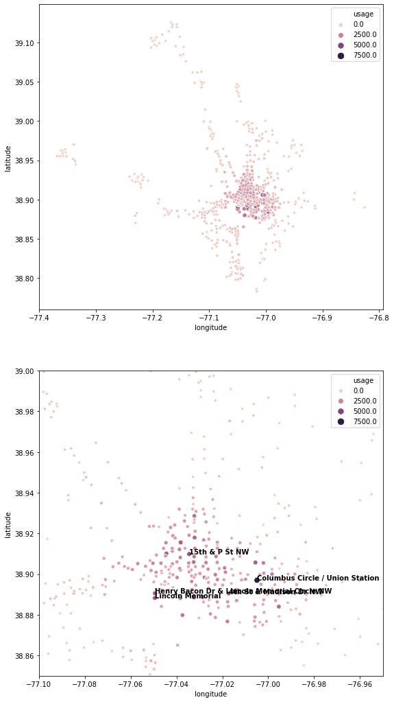

```python
import numpy as np
import pandas as pd
import seaborn as sns
from matplotlib import pyplot as plt
import os
from pathlib import Path
%matplotlib inline
%load_ext autoreload
%autoreload 2
```

    The autoreload extension is already loaded. To reload it, use:
      %reload_ext autoreload


```python
from modules import preprocess_data
since2019 = [Path(os.getcwd(), 'data', f) for f in os.listdir('data') if f.startswith(('2019'))]
trips = preprocess_data.master_data(since2019)
```

    In trips(start) but not in stations: [32031.0, 31008.0, 32051.0, 0.0]
    In stations but not in trips(start) [31325.0, 32901.0]
    In trips(end) but not in stations: [0.0, 32051.0, 31008.0, 32031.0]
    In stations but not in start [31718.0, 31325.0, 32901.0]


```python
def print_unique_values(df, show_limit = 20):
    for col in df.columns:
        if df[col].dtypes == 'O':
            unique_values = df[col].unique()
            if len(unique_values) > show_limit:
                print("%s : %s unique values" % (col, len(unique_values)))
            else:
                print("%s : \n%s" % (col, df[col].value_counts()))
            print('---------------------')

print_unique_values(trips)
```

    start_station : 648 unique values
    ---------------------
    end_station : 647 unique values
    ---------------------
    bike_number : 6053 unique values
    ---------------------
    member_type : 
    Member    2955802
    Casual     440863
    Name: member_type, dtype: int64
    ---------------------
    date : 365 unique values
    ---------------------
    holiday : 
    False    3335505
    True       61160
    Name: holiday, dtype: int64
    ---------------------
    weekend : 
    False    2996883
    True      399782
    Name: weekend, dtype: int64
    ---------------------


```python
# sample for scripting
df = trips.sample(200000)
```


```python
df['duration_m'] = df['duration']/60
```

# Explaratory Data Analysis

    * Basic facts
        - Number of trips
        - Number of stations
        - Number of bikes
        - Most popular routes
        - Most popular stations
    * Number of trips, duration by:
        - Rider type
        - Time of the trip
            - Month
            - Hour
    * Stations
        - locations
    * Understanding demand
        - 
    * Over time:
        - Usage over time
        - Station expansion over time

## Basic Facts

### Number of trips 


```python
print("Total number of trips in 2019: {:,}".format(df.shape[0]))
sns.countplot(data=df, x='month')
df.groupby(['year', 'month']).size().rename('trips').to_frame()
```

    Total number of trips in 2019: 200,000


<div>
<style scoped>
    .dataframe tbody tr th:only-of-type {
        vertical-align: middle;
    }

    .dataframe tbody tr th {
        vertical-align: top;
    }

    .dataframe thead th {
        text-align: right;
    }
</style>
<table border="1" class="dataframe">
  <thead>
    <tr style="text-align: right;">
      <th></th>
      <th></th>
      <th>trips</th>
    </tr>
    <tr>
      <th>year</th>
      <th>month</th>
      <th></th>
    </tr>
  </thead>
  <tbody>
    <tr>
      <th rowspan="12" valign="top">2019.0</th>
      <th>1.0</th>
      <td>8896</td>
    </tr>
    <tr>
      <th>2.0</th>
      <td>9182</td>
    </tr>
    <tr>
      <th>3.0</th>
      <td>14972</td>
    </tr>
    <tr>
      <th>4.0</th>
      <td>20330</td>
    </tr>
    <tr>
      <th>5.0</th>
      <td>19896</td>
    </tr>
    <tr>
      <th>6.0</th>
      <td>20684</td>
    </tr>
    <tr>
      <th>7.0</th>
      <td>21230</td>
    </tr>
    <tr>
      <th>8.0</th>
      <td>21109</td>
    </tr>
    <tr>
      <th>9.0</th>
      <td>21114</td>
    </tr>
    <tr>
      <th>10.0</th>
      <td>19925</td>
    </tr>
    <tr>
      <th>11.0</th>
      <td>13250</td>
    </tr>
    <tr>
      <th>12.0</th>
      <td>9412</td>
    </tr>
  </tbody>
</table>
</div>





More rides during warmer months

### Number of stations in use


```python
print("Number of stations in use > 0: {:,}".format(len(df.station_id.unique())))
```

    Number of stations in use > 0: 574


### Number of bikes in use


```python
print("Number of bikes in use> 0: {:,}".format(len(df.bike_number.unique())))
```

    Number of bikes in use> 0: 5,924


### Most popular routes


```python
popular_routes = df.groupby(['start_station', 'end_station']).size().rename('trips').to_frame()
popular_routes.sort_values('trips', ascending=False).head(20)
```


<div>
<style scoped>
    .dataframe tbody tr th:only-of-type {
        vertical-align: middle;
    }

    .dataframe tbody tr th {
        vertical-align: top;
    }

    .dataframe thead th {
        text-align: right;
    }
</style>
<table border="1" class="dataframe">
  <thead>
    <tr style="text-align: right;">
      <th></th>
      <th></th>
      <th>trips</th>
    </tr>
    <tr>
      <th>start_station</th>
      <th>end_station</th>
      <th></th>
    </tr>
  </thead>
  <tbody>
    <tr>
      <th>Smithsonian-National Mall / Jefferson Dr &amp; 12th St SW</th>
      <th>Smithsonian-National Mall / Jefferson Dr &amp; 12th St SW</th>
      <td>312</td>
    </tr>
    <tr>
      <th>Columbus Circle / Union Station</th>
      <th>6th &amp; H St NE</th>
      <td>267</td>
    </tr>
    <tr>
      <th>6th &amp; H St NE</th>
      <th>Columbus Circle / Union Station</th>
      <td>223</td>
    </tr>
    <tr>
      <th>Columbus Circle / Union Station</th>
      <th>8th &amp; F St NE</th>
      <td>216</td>
    </tr>
    <tr>
      <th>4th St &amp; Madison Dr NW</th>
      <th>4th St &amp; Madison Dr NW</th>
      <td>210</td>
    </tr>
    <tr>
      <th>Jefferson Dr &amp; 14th St SW</th>
      <th>Jefferson Dr &amp; 14th St SW</th>
      <td>198</td>
    </tr>
    <tr>
      <th>17th St &amp; Independence Ave SW</th>
      <th>Lincoln Memorial</th>
      <td>197</td>
    </tr>
    <tr>
      <th>Lincoln Memorial</th>
      <th>Jefferson Memorial</th>
      <td>191</td>
    </tr>
    <tr>
      <th>8th &amp; F St NE</th>
      <th>Columbus Circle / Union Station</th>
      <td>182</td>
    </tr>
    <tr>
      <th>Jefferson Dr &amp; 14th St SW</th>
      <th>Lincoln Memorial</th>
      <td>179</td>
    </tr>
    <tr>
      <th>Smithsonian-National Mall / Jefferson Dr &amp; 12th St SW</th>
      <th>Lincoln Memorial</th>
      <td>164</td>
    </tr>
    <tr>
      <th>14th &amp; Irving St NW</th>
      <th>11th &amp; Girard St NW</th>
      <td>157</td>
    </tr>
    <tr>
      <th>15th St &amp; Constitution Ave NW</th>
      <th>15th St &amp; Constitution Ave NW</th>
      <td>153</td>
    </tr>
    <tr>
      <th>13th &amp; H St NE</th>
      <th>Columbus Circle / Union Station</th>
      <td>152</td>
    </tr>
    <tr>
      <th>Lincoln Memorial</th>
      <th>Lincoln Memorial</th>
      <td>151</td>
    </tr>
    <tr>
      <th>17th St &amp; Independence Ave SW</th>
      <th>17th St &amp; Independence Ave SW</th>
      <td>150</td>
    </tr>
    <tr>
      <th>Maryland Ave &amp; E St NE</th>
      <th>Columbus Circle / Union Station</th>
      <td>149</td>
    </tr>
    <tr>
      <th>Henry Bacon Dr &amp; Lincoln Memorial Circle NW</th>
      <th>Henry Bacon Dr &amp; Lincoln Memorial Circle NW</th>
      <td>149</td>
    </tr>
    <tr>
      <th>Eastern Market Metro / Pennsylvania Ave &amp; 7th St SE</th>
      <th>Lincoln Park / 13th &amp; East Capitol St NE</th>
      <td>143</td>
    </tr>
    <tr>
      <th>Lincoln Park / 13th &amp; East Capitol St NE</th>
      <th>Eastern Market Metro / Pennsylvania Ave &amp; 7th St SE</th>
      <td>141</td>
    </tr>
  </tbody>
</table>
</div>


>Mostly around the mall and downtown

## Most popular stations by either starting or ending a trip


```python
start = df.groupby(['start_station_id', 'start_station']).size().rename('start').astype(int)
end = df.groupby(['end_station_id', 'end_station']).size().rename('end').astype(int)

start.index.levels[0].name = 'id'
start.index.levels[1].name = 'station'
end.index.levels[0].name = 'id'
end.index.levels[1].name = 'station'

s = pd.merge(start, end, 'outer', left_index=True, right_index=True)

# a peak at stations_use indicates that some station id has multiple station names
# probably slightly different versions of the station names have been recorded over time in trips data
s1 = s.droplevel(1, axis=0)
s1 = s1.groupby(s1.index).sum()

s2 = s.reset_index('station')[['station']]
s2 = s2.groupby(s2.index).apply(lambda x: x.iloc[0,]) # pick the value from the first row
stations_use = pd.concat([s2, s1], axis=1)

# some start values and some end values (for different indices) will be NaN because
# some stations only started trips or ended trips. Replace with 0.
stations_use['start'] = stations_use['start'].fillna(0)
stations_use['end'] = stations_use['end'].fillna(0)
stations_use['usage'] = stations_use['start'] + stations_use['end']

stations_use = stations_use.sort_values('usage', ascending=False)
stations_use.head(20)
```


<div>
<style scoped>
    .dataframe tbody tr th:only-of-type {
        vertical-align: middle;
    }

    .dataframe tbody tr th {
        vertical-align: top;
    }

    .dataframe thead th {
        text-align: right;
    }
</style>
<table border="1" class="dataframe">
  <thead>
    <tr style="text-align: right;">
      <th></th>
      <th>station</th>
      <th>start</th>
      <th>end</th>
      <th>usage</th>
    </tr>
    <tr>
      <th>id</th>
      <th></th>
      <th></th>
      <th></th>
      <th></th>
    </tr>
  </thead>
  <tbody>
    <tr>
      <th>31623.0</th>
      <td>Columbus Circle / Union Station</td>
      <td>3415.0</td>
      <td>3789.0</td>
      <td>7204.0</td>
    </tr>
    <tr>
      <th>31201.0</th>
      <td>15th &amp; P St NW</td>
      <td>2021.0</td>
      <td>2288.0</td>
      <td>4309.0</td>
    </tr>
    <tr>
      <th>31258.0</th>
      <td>Lincoln Memorial</td>
      <td>1975.0</td>
      <td>2119.0</td>
      <td>4094.0</td>
    </tr>
    <tr>
      <th>31289.0</th>
      <td>Henry Bacon Dr &amp; Lincoln Memorial Circle NW</td>
      <td>2034.0</td>
      <td>1992.0</td>
      <td>4026.0</td>
    </tr>
    <tr>
      <th>31288.0</th>
      <td>4th St &amp; Madison Dr NW</td>
      <td>1946.0</td>
      <td>1965.0</td>
      <td>3911.0</td>
    </tr>
    <tr>
      <th>31248.0</th>
      <td>Smithsonian-National Mall / Jefferson Dr &amp; 12t...</td>
      <td>1835.0</td>
      <td>2035.0</td>
      <td>3870.0</td>
    </tr>
    <tr>
      <th>31247.0</th>
      <td>Jefferson Dr &amp; 14th St SW</td>
      <td>1869.0</td>
      <td>1990.0</td>
      <td>3859.0</td>
    </tr>
    <tr>
      <th>31200.0</th>
      <td>Massachusetts Ave &amp; Dupont Circle NW</td>
      <td>1718.0</td>
      <td>2128.0</td>
      <td>3846.0</td>
    </tr>
    <tr>
      <th>31229.0</th>
      <td>New Hampshire Ave &amp; T St NW</td>
      <td>2037.0</td>
      <td>1785.0</td>
      <td>3822.0</td>
    </tr>
    <tr>
      <th>31603.0</th>
      <td>1st &amp; M St NE</td>
      <td>1881.0</td>
      <td>1897.0</td>
      <td>3778.0</td>
    </tr>
    <tr>
      <th>31101.0</th>
      <td>14th &amp; U St NW</td>
      <td>1566.0</td>
      <td>1910.0</td>
      <td>3476.0</td>
    </tr>
    <tr>
      <th>31613.0</th>
      <td>Eastern Market Metro / Pennsylvania Ave &amp; 7th ...</td>
      <td>1718.0</td>
      <td>1651.0</td>
      <td>3369.0</td>
    </tr>
    <tr>
      <th>31124.0</th>
      <td>14th &amp; Irving St NW</td>
      <td>2123.0</td>
      <td>1132.0</td>
      <td>3255.0</td>
    </tr>
    <tr>
      <th>31241.0</th>
      <td>Thomas Circle</td>
      <td>1660.0</td>
      <td>1428.0</td>
      <td>3088.0</td>
    </tr>
    <tr>
      <th>31249.0</th>
      <td>Jefferson Memorial</td>
      <td>1505.0</td>
      <td>1580.0</td>
      <td>3085.0</td>
    </tr>
    <tr>
      <th>31203.0</th>
      <td>14th &amp; Rhode Island Ave NW</td>
      <td>1372.0</td>
      <td>1480.0</td>
      <td>2852.0</td>
    </tr>
    <tr>
      <th>31627.0</th>
      <td>3rd &amp; M St NE</td>
      <td>1347.0</td>
      <td>1379.0</td>
      <td>2726.0</td>
    </tr>
    <tr>
      <th>31230.0</th>
      <td>Metro Center / 12th &amp; G St NW</td>
      <td>1216.0</td>
      <td>1496.0</td>
      <td>2712.0</td>
    </tr>
    <tr>
      <th>31321.0</th>
      <td>15th St &amp; Constitution Ave NW</td>
      <td>1292.0</td>
      <td>1419.0</td>
      <td>2711.0</td>
    </tr>
    <tr>
      <th>31290.0</th>
      <td>17th St &amp; Independence Ave SW</td>
      <td>1390.0</td>
      <td>1309.0</td>
      <td>2699.0</td>
    </tr>
  </tbody>
</table>
</div>


# Trips and Duration

### Trips by Member type


```python
df_member = df.groupby('member_type').apply(lambda x: len(x)/len(df)*100)
df_member
ax = sns.barplot(x=df_member.index, y=df_member.values)
ax.set(ylabel="Percent")
```


    [Text(0, 0.5, 'Percent')]





> \>80% of the trips are taken by members

## Duration by Member Type


```python
sns.barplot(x='member_type', y='duration_m', data=df)
```


    <matplotlib.axes._subplots.AxesSubplot at 0x2b7fbee10>





> The average trip duration in minute shows that casual riders have much longer trips than members, 40 mins vs 15 mins

Capital Bikeshare has a pricing scheme where the first 30 mins is free for members and a some price for casual riders, and the price for an additional 30 min block goes up exponentially, starting at \\$2 and capping at \\$8 after an hour and a half. For instance, for memebrs who pay a monthly fee, the first 30 mins is \\$0, the second 30 mins \\$2, the next 30 mins \\$4, and \\$8 for every additional 30 mins beyond that. The inconvenience notwithstanding, it's most economical to return the bike to a station within 30 minutes and check the same bike out if the destination is more than 30 minutes away 

Let's break duration to 30 min blocks


```python
cutoffs = [0, 30, 60, 90, np.Inf]
df['duration_m_cat'] = pd.cut(df.duration_m, cutoffs, right = False)
```


```python
fig, ax = plt.subplots(2, 1, figsize=(12, 5))
sns.countplot(x='duration_m_cat', data=df.query('member_type=="Member"'), ax=ax[0])
sns.countplot(x='duration_m_cat', data=df.query('member_type=="Casual"'), ax=ax[1])
```


    <matplotlib.axes._subplots.AxesSubplot at 0x47bd9d940>





> A considerable share of casual trips are over 1 hour, indicating either casual riders are not price sensitive or don't understand the incremental pricing scheme

## By Trip Start Time

Because members and casual riders clearly display different usage, I'll analyze them separately. Looking at the trips by time further shows that members and casual riders have distinctive usage patterns.

### Hour


```python
figsize, ax = plt.subplots(2, 1, figsize=(9, 6))
sns.countplot(x='hour', data=df.query('member_type=="Member"'), ax=ax[0])
sns.countplot(x='hour', data=df.query('member_type=="Casual"'), ax=ax[1])
```


    <matplotlib.axes._subplots.AxesSubplot at 0x14e4f0908>





> Member usage peak during commute times while casual usage is normally distributed during the day

### Month


```python
figsize, ax = plt.subplots(2, 1, figsize=(9, 6))
sns.countplot(x='month', data=df.query('member_type=="Member"'), ax=ax[0])
sns.countplot(x='month', data=df.query('member_type=="Casual"'), ax=ax[1])
```


    <matplotlib.axes._subplots.AxesSubplot at 0x481094358>





> Members use the bikes more or less consistently during the warm months (April through October) while casual riders peak in April (cherry blossoms!) and in summer months 


```python
sns.lmplot(x='duration_m', y='distance', col = 'member_type', data = df.query('duration < 20000'))
```


    <seaborn.axisgrid.FacetGrid at 0x4812fccf8>





# Stations


```python
# Get latitude and longitude from stations data
stations_use = pd.merge(stations_use, stations, how='left', left_index=True, right_on='station_id')
```


```python
stations_use.shape
```


    (574, 8)


```python
stations_use.head()
```


<div>
<style scoped>
    .dataframe tbody tr th:only-of-type {
        vertical-align: middle;
    }

    .dataframe tbody tr th {
        vertical-align: top;
    }

    .dataframe thead th {
        text-align: right;
    }
</style>
<table border="1" class="dataframe">
  <thead>
    <tr style="text-align: right;">
      <th></th>
      <th>station</th>
      <th>start</th>
      <th>end</th>
      <th>usage</th>
      <th>station_id</th>
      <th>latitude</th>
      <th>longitude</th>
      <th>capacity</th>
    </tr>
  </thead>
  <tbody>
    <tr>
      <th>460</th>
      <td>Eads St &amp; 15th St S</td>
      <td>86.0</td>
      <td>81.0</td>
      <td>167.0</td>
      <td>31000.0</td>
      <td>38.858971</td>
      <td>-77.053230</td>
      <td>15.0</td>
    </tr>
    <tr>
      <th>461</th>
      <td>18th &amp; Eads St.</td>
      <td>109.0</td>
      <td>111.0</td>
      <td>220.0</td>
      <td>31001.0</td>
      <td>38.857250</td>
      <td>-77.053320</td>
      <td>11.0</td>
    </tr>
    <tr>
      <th>462</th>
      <td>Crystal Dr &amp; 20th St S</td>
      <td>338.0</td>
      <td>332.0</td>
      <td>670.0</td>
      <td>31002.0</td>
      <td>38.856425</td>
      <td>-77.049232</td>
      <td>16.0</td>
    </tr>
    <tr>
      <th>463</th>
      <td>Crystal Dr &amp; 15th St S</td>
      <td>229.0</td>
      <td>239.0</td>
      <td>468.0</td>
      <td>31003.0</td>
      <td>38.860170</td>
      <td>-77.049593</td>
      <td>11.0</td>
    </tr>
    <tr>
      <th>464</th>
      <td>Aurora Hills Cmty Ctr / 18th St &amp; S Hayes St</td>
      <td>121.0</td>
      <td>105.0</td>
      <td>226.0</td>
      <td>31004.0</td>
      <td>38.857866</td>
      <td>-77.059490</td>
      <td>11.0</td>
    </tr>
  </tbody>
</table>
</div>


```python
sns.distplot(a=stations_use.usage, kde=False)
```


    <matplotlib.axes._subplots.AxesSubplot at 0x150fb9780>





> The usage distribution is heavily left-skewed, indicating many are underutilized and few get disporportionate amount of use.


```python
fig, ax = plt.subplots(2, 1, figsize=(9, 18))
g1 = sns.scatterplot(x='longitude', y='latitude', size='usage', hue='usage', data=stations_use, s=20, ax=ax[0])
ax[1].set(xlim=(-77.1, -76.95), ylim=(38.85, 39))

g2 = sns.scatterplot(x='longitude', y='latitude', size='usage', hue='usage', data=stations_use, s=200, ax=ax[1]) # why doesn't the size work??
for i in range(5):
    x_coor = stations_use.iloc[i, ].longitude
    y_coor = stations_use.iloc[i, ].latitude
    name = stations_use.iloc[i, ].station
    g2.text(x_coor, y_coor, name, horizontalalignment='left', size='medium', color='black', weight='semibold')
```





```python
stations.shape
```


    (576, 9)


## Bike Usage


```python
df.groupby('bike_number').size().to_frame()
```


<div>
<style scoped>
    .dataframe tbody tr th:only-of-type {
        vertical-align: middle;
    }

    .dataframe tbody tr th {
        vertical-align: top;
    }

    .dataframe thead th {
        text-align: right;
    }
</style>
<table border="1" class="dataframe">
  <thead>
    <tr style="text-align: right;">
      <th></th>
      <th>0</th>
    </tr>
    <tr>
      <th>bike_number</th>
      <th></th>
    </tr>
  </thead>
  <tbody>
    <tr>
      <th>21054</th>
      <td>6</td>
    </tr>
    <tr>
      <th>51020</th>
      <td>1</td>
    </tr>
    <tr>
      <th>51033</th>
      <td>11</td>
    </tr>
    <tr>
      <th>51045</th>
      <td>7</td>
    </tr>
    <tr>
      <th>65005</th>
      <td>4</td>
    </tr>
    <tr>
      <th>65009</th>
      <td>13</td>
    </tr>
    <tr>
      <th>65012</th>
      <td>12</td>
    </tr>
    <tr>
      <th>65033</th>
      <td>13</td>
    </tr>
    <tr>
      <th>65038</th>
      <td>5</td>
    </tr>
    <tr>
      <th>65043</th>
      <td>10</td>
    </tr>
    <tr>
      <th>70004</th>
      <td>37</td>
    </tr>
    <tr>
      <th>70015</th>
      <td>8</td>
    </tr>
    <tr>
      <th>70031</th>
      <td>9</td>
    </tr>
    <tr>
      <th>70047</th>
      <td>7</td>
    </tr>
    <tr>
      <th>70064</th>
      <td>11</td>
    </tr>
    <tr>
      <th>70079</th>
      <td>13</td>
    </tr>
    <tr>
      <th>70087</th>
      <td>13</td>
    </tr>
    <tr>
      <th>70105</th>
      <td>16</td>
    </tr>
    <tr>
      <th>70142</th>
      <td>14</td>
    </tr>
    <tr>
      <th>70151</th>
      <td>3</td>
    </tr>
    <tr>
      <th>70159</th>
      <td>12</td>
    </tr>
    <tr>
      <th>70172</th>
      <td>13</td>
    </tr>
    <tr>
      <th>70174</th>
      <td>10</td>
    </tr>
    <tr>
      <th>70231</th>
      <td>24</td>
    </tr>
    <tr>
      <th>70232</th>
      <td>27</td>
    </tr>
    <tr>
      <th>75400</th>
      <td>4</td>
    </tr>
    <tr>
      <th>75405</th>
      <td>1</td>
    </tr>
    <tr>
      <th>75409</th>
      <td>7</td>
    </tr>
    <tr>
      <th>75414</th>
      <td>11</td>
    </tr>
    <tr>
      <th>75415</th>
      <td>9</td>
    </tr>
    <tr>
      <th>...</th>
      <td>...</td>
    </tr>
    <tr>
      <th>W24822</th>
      <td>3</td>
    </tr>
    <tr>
      <th>W24823</th>
      <td>1</td>
    </tr>
    <tr>
      <th>W24829</th>
      <td>1</td>
    </tr>
    <tr>
      <th>W24832</th>
      <td>1</td>
    </tr>
    <tr>
      <th>W24834</th>
      <td>1</td>
    </tr>
    <tr>
      <th>W24835</th>
      <td>1</td>
    </tr>
    <tr>
      <th>W24836</th>
      <td>3</td>
    </tr>
    <tr>
      <th>W24838</th>
      <td>2</td>
    </tr>
    <tr>
      <th>W24839</th>
      <td>1</td>
    </tr>
    <tr>
      <th>W24840</th>
      <td>2</td>
    </tr>
    <tr>
      <th>W24841</th>
      <td>1</td>
    </tr>
    <tr>
      <th>W24842</th>
      <td>3</td>
    </tr>
    <tr>
      <th>W24843</th>
      <td>1</td>
    </tr>
    <tr>
      <th>W24844</th>
      <td>1</td>
    </tr>
    <tr>
      <th>W24845</th>
      <td>2</td>
    </tr>
    <tr>
      <th>W24846</th>
      <td>1</td>
    </tr>
    <tr>
      <th>W24847</th>
      <td>1</td>
    </tr>
    <tr>
      <th>W24858</th>
      <td>1</td>
    </tr>
    <tr>
      <th>W24859</th>
      <td>1</td>
    </tr>
    <tr>
      <th>W24860</th>
      <td>1</td>
    </tr>
    <tr>
      <th>W24864</th>
      <td>1</td>
    </tr>
    <tr>
      <th>W24865</th>
      <td>1</td>
    </tr>
    <tr>
      <th>W24869</th>
      <td>1</td>
    </tr>
    <tr>
      <th>W24870</th>
      <td>3</td>
    </tr>
    <tr>
      <th>W24872</th>
      <td>1</td>
    </tr>
    <tr>
      <th>W24875</th>
      <td>1</td>
    </tr>
    <tr>
      <th>W24877</th>
      <td>2</td>
    </tr>
    <tr>
      <th>W24878</th>
      <td>1</td>
    </tr>
    <tr>
      <th>W24880</th>
      <td>2</td>
    </tr>
    <tr>
      <th>W99910</th>
      <td>1</td>
    </tr>
  </tbody>
</table>
<p>5924 rows × 1 columns</p>
</div>


```python
stations_use.capacity.sum()
```


```python

```


```python

```


```python

```


```python

```
